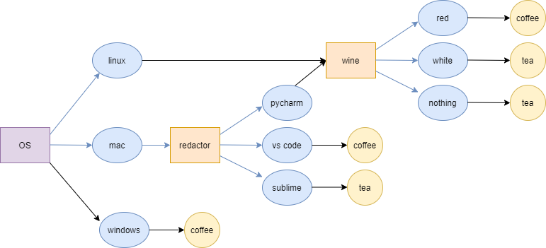

# Реализация алгоритма ID3
В данной лабораторной работе мы занимались построением дерева решений на основе **алгоритма ID3**.

Дерево решений было построено на основе исходного набора данных о нашей группе. Студенты классифицируются по целевому признаку "drinks" в зависимости от того, что они предпочитают: кофе или чай. 

Необходимые библиотеки: 
* math, 
* pandas, 
* functools
